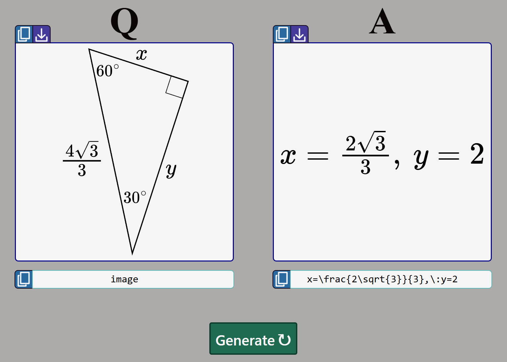

# NumberQ

NumberQ is a free tool for creating random math problems with custom properties. The problem creators are available at [number-q.com](https://number-q.com). Currently, there are 21 problem generators, and they cover some topics at the following math levels: arithmetic, algebra, geometry, pre-calculus, and linear algebra.

The problems can be copied and downloaded as images, or they can be copied as LaTeX.

  

